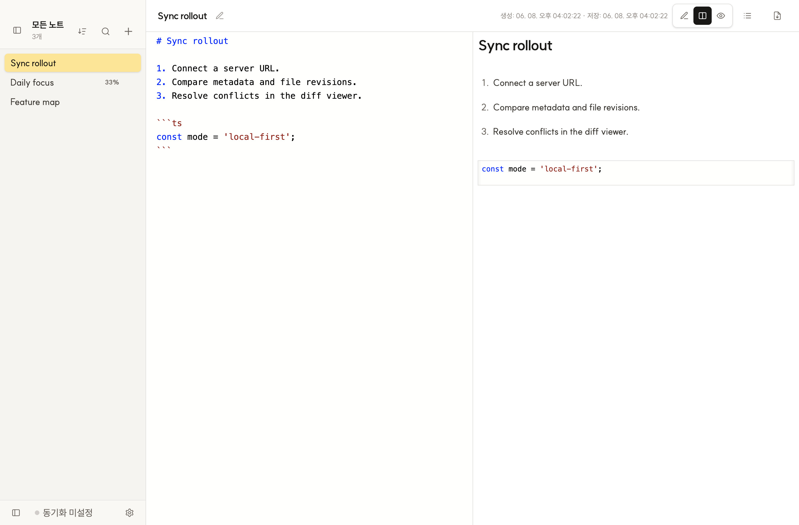
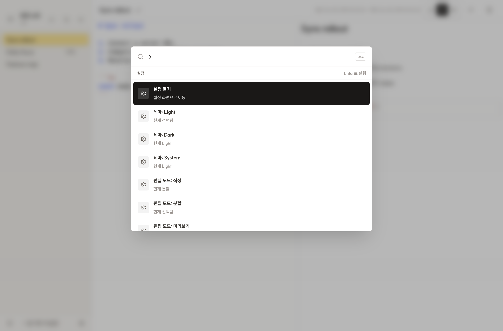
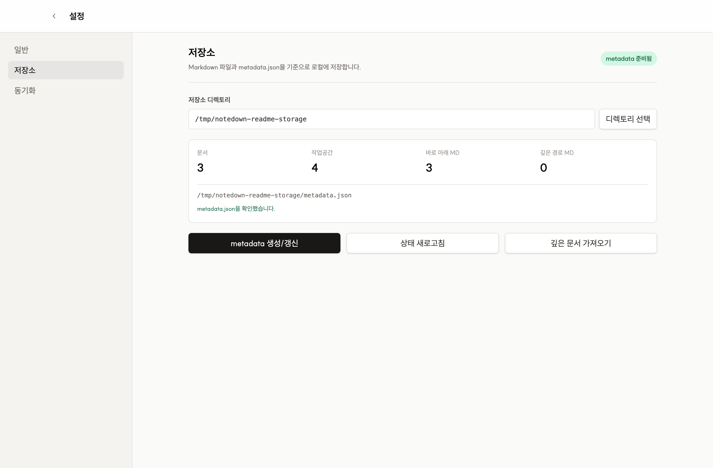

# Notedown

Notedown is a local-first Markdown notes app built with Electron, Capacitor Android, WIZ, and Angular. It is designed for writing Markdown files in a readable local workspace, previewing them immediately, exporting PDFs, and syncing later when a server is available.

> Developed by [WIZ](https://github.com/season-framework/wiz) with AI.

## Screenshots







---

## 한국어

Notedown은 데스크톱과 Android에서 Markdown 문서를 빠르게 작성하고 로컬 파일로 관리하는 노트 앱입니다. Electron/Capacitor 셸 위에 WIZ/Angular 화면을 올렸고, 저장소는 읽기 쉬운 Markdown 파일 경로와 `metadata.db`를 기준으로 동작합니다. 필요할 때 서버 동기화, 충돌 비교, PDF 내보내기를 사용할 수 있습니다.

### 주요 기능

- 로컬 우선 저장소: Electron 기본 경로는 `~/Documents/Notedown Notes`이며, Android는 앱 전용 저장소의 Notedown 폴더를 사용합니다.
- 읽기 쉬운 파일 구조: 앱의 폴더 표시명과 문서 제목을 실제 폴더/Markdown 파일명으로 사용하고, 세부 메타데이터는 SQLite `metadata.db`에 저장합니다.
- 저장소 관리: 저장소 디렉토리 선택, `metadata.db` 생성/갱신, 저장소 상태 확인, 깊은 경로 Markdown 문서 가져오기를 지원합니다.
- Markdown 작성 화면: Monaco 기반 편집기, 작성/분할/미리보기 모드, 에디터와 미리보기 hover 동기화, Markdown 접기 UI를 제공합니다.
- 문서 렌더링: 체크리스트 진행률, 코드 블록, 인용문, 표, 구분선, 문서/구역 단위 스타일 지시문을 미리보기와 PDF 출력에 반영합니다.
- 사이드바: 워크스페이스 패널, 폴더 이름 인라인 수정, 노트 검색, 정렬, 새 노트 생성, 노트 삭제, 최근 동기화 상태 표시를 제공합니다.
- 커맨드 팔렛트: `Cmd/Ctrl+P`로 노트 검색을 열고, `@`로 워크스페이스 선택, `>`로 설정 명령을 실행할 수 있습니다.
- 설정: 수동 저장 중심의 저장 흐름, 닫을 때 백그라운드 유지, 시작 프로그램 등록, 기본 보기 모드, 탭 크기, Light/Dark/System 테마를 관리합니다.
- 첨부 파일: 이미지/파일 첨부, 미리보기 렌더링, 파일 열기, PDF용 첨부 ZIP 생성을 지원합니다.
- PDF 내보내기: Electron `printToPDF` 또는 Android 네이티브 PDF 흐름으로 현재 노트를 저장합니다.
- 서버 동기화: 서버 연결 확인, 초기 설정, 로그인, 전체 동기화, 문서/첨부 저장 시 업로드, 시작 시 동기화, 충돌 감지를 지원합니다.
- 충돌 해결: 동기화 충돌이 발생하면 노트 화면에서 서버 버전과 로컬 버전을 Monaco diff 뷰어로 비교하고 선택한 버전을 적용합니다.
- 데스크톱/모바일 동작: macOS 상태바/Windows 트레이에서 다시 열기, Android 파일 선택/공유 저장, 백그라운드 유지와 시작 프로그램 등록 설정, Notedown 이름과 앱 아이콘이 적용된 패키징을 지원합니다.

### 기본 워크플로

1. 설정의 저장소 화면에서 로컬 Markdown 저장소를 선택하거나 기본 경로를 사용합니다.
2. 노트 화면에서 워크스페이스별 문서를 작성하고 분할 보기로 결과를 확인한 뒤 수동 저장합니다.
3. 커맨드 팔렛트로 노트, 워크스페이스, 설정 명령을 빠르게 이동합니다.
4. 필요하면 첨부 파일을 추가하고 PDF/첨부 ZIP으로 내보내거나 서버 동기화를 실행합니다.
5. 충돌이 감지되면 diff 뷰어에서 서버/로컬 버전 중 하나를 적용합니다.

### 저장소 형식

- `relativePath`는 동기화용 논리 식별자입니다.
- `storagePath`는 실제 파일 시스템에 저장되는 읽기 쉬운 경로입니다.
- `metadata.db`는 워크스페이스, 노트, 첨부 파일 메타데이터를 저장합니다.
- `metadata.json`은 더 이상 생성하지 않습니다.
- 첨부 파일은 기본적으로 `<워크스페이스>/attachments/<노트명>/` 아래에 저장됩니다.

### 프로젝트 구조

```text
project/main/
├── electron/              # Electron main/preload 프로세스
├── android/               # Capacitor Android native project
├── src/app/               # WIZ/Angular 화면 앱
├── src/assets/brand/      # 서비스 로고와 원본 브랜드 에셋
├── build-resources/       # Electron 빌드용 icon.icns/icon.ico/icon.png
├── bundle/www/            # Electron이 로드하는 WIZ/Angular 번들
├── screenshots/           # README와 배포 문서용 앱 스크린샷
└── dist/                  # Electron 배포 산출물
```

### 실행

```bash
npm install
npm run electron
```

개발 서버에 Electron을 연결할 때는 다음처럼 실행합니다.

```bash
NOTEDOWN_DEV_URL=http://localhost:4200 npm run electron
```

### Android 환경

Android 앱은 Capacitor로 구성되어 있으며 `bundle/www/`의 WIZ/Angular 번들을 로드합니다. 현재 Android 브리지는 앱 설정, 앱 전용 로컬 저장소, `metadata.db` 기반 Markdown/첨부 저장, 읽기 쉬운 `storagePath`, 첨부 파일 선택/저장/열기, 동기화 서버 health/setup/login, 전체 동기화, 저장 시 업로드, 충돌 파일 비교/해결, PDF 저장을 지원합니다.

```bash
npm install
npm run android:sync
npm run android:open
npm run android:build:debug
```

필요 SDK, 권한, 로컬 HTTP 정책은 [Android Environment](./docs/android-environment.md)를 참고하세요.

### 배포 빌드

Electron 패키징 전에 WIZ/Angular 번들을 최신 상태로 갱신해 `bundle/www/`에 반영해야 합니다.

```bash
npm run dist:mac:arm64
npm run dist:mac:x64
npm run dist:win:nsis
```

요청된 세 플랫폼을 한 번에 빌드하려면 다음 스크립트를 사용할 수 있습니다.

```bash
npm run dist:requested
```

생성 산출물은 `dist/`에 저장됩니다.

### 작성자

- [ImuruKevol](https://github.com/ImuruKevol)

### 라이선스

MIT License. 자세한 내용은 `LICENSE`를 참고하세요.

---

## English

Notedown is a desktop and Android Markdown note app for writing quickly, keeping notes as local files, and syncing them when needed. It combines Electron/Capacitor shells with a WIZ/Angular interface, stores Markdown files with readable paths and `metadata.db`, and supports packaged builds for macOS, Windows, and Android.

### Features

- Local-first storage: Electron defaults to `~/Documents/Notedown Notes`, and Android uses an app-specific Notedown folder.
- Readable file layout: workspace display names and note titles are used as physical folder/Markdown file names, while detailed metadata is stored in SQLite `metadata.db`.
- Storage management: choose a storage directory, generate or refresh `metadata.db`, inspect storage status, and import deeply nested Markdown documents.
- Markdown workspace: Monaco-based editor, write/split/preview modes, editor-preview hover sync, and Markdown folding controls.
- Document rendering: task progress, code blocks, quotes, tables, dividers, and document/section style directives are reflected in preview and PDF output.
- Sidebar: workspace panel, inline folder rename, note search, sorting, new note creation, note deletion, and recent sync status.
- Command palette: open note search with `Cmd/Ctrl+P`, use `@` for workspace selection, and use `>` for settings commands.
- Settings: manual-save-oriented editing, keep in background on close, launch at startup, default editor mode, tab size, and Light/Dark/System theme.
- Attachments: attach images/files, render previews, open files, and include attachments in PDF ZIP exports.
- PDF export: save the current note through Electron `printToPDF` or Android native PDF output.
- Server sync: health check, initial setup, login, full sync, save-time document/attachment upload, startup sync, and conflict detection.
- Conflict resolution: compare server and local versions in a Monaco diff viewer, then apply the selected version.
- Desktop/mobile behavior: reopen from macOS status bar or Windows tray, use Android file pick/save flows, configure background close and launch-at-startup behavior, and package with the Notedown name and app icon.

### Basic Workflow

1. Pick a local Markdown storage folder in Settings, or use the default path.
2. Write documents by workspace, check the rendered result in split view, and save manually.
3. Jump between notes, workspaces, and settings commands with the command palette.
4. Add attachments when needed, export a PDF or attachment ZIP, or run server sync.
5. Resolve sync conflicts by choosing the server or local version in the diff viewer.

### Storage Format

- `relativePath` is the logical sync identity.
- `storagePath` is the readable path used on the actual filesystem.
- `metadata.db` stores workspace, note, and attachment metadata.
- `metadata.json` is no longer generated.
- Attachments are stored under `<workspace>/attachments/<note-title>/` by default.

### Project Structure

```text
project/main/
├── electron/              # Electron main/preload process
├── android/               # Capacitor Android native project
├── src/app/               # WIZ/Angular app screens
├── src/assets/brand/      # Source brand logo assets
├── build-resources/       # Electron build icons: icon.icns/icon.ico/icon.png
├── bundle/www/            # WIZ/Angular bundle loaded by Electron
├── screenshots/           # App screenshots for README and release docs
└── dist/                  # Electron release artifacts
```

### Run

```bash
npm install
npm run electron
```

To attach Electron to a development server:

```bash
NOTEDOWN_DEV_URL=http://localhost:4200 npm run electron
```

### Android Environment

The Android app is configured with Capacitor and loads the WIZ/Angular bundle from `bundle/www/`. The current Android bridge supports app preferences, app-specific local note storage, `metadata.db`-backed Markdown/attachment persistence, readable `storagePath` values, attachment pick/save/open, sync server health/setup/login, full sync, save-time upload, conflict read/resolve, and PDF export.

```bash
npm install
npm run android:sync
npm run android:open
npm run android:build:debug
```

See [Android Environment](./docs/android-environment.md) for SDK prerequisites, permissions, and local HTTP policy.

### Release Builds

Refresh the WIZ/Angular bundle into `bundle/www/` before packaging the Electron app.

```bash
npm run dist:mac:arm64
npm run dist:mac:x64
npm run dist:win:nsis
```

To build all requested targets:

```bash
npm run dist:requested
```

Release artifacts are written to `dist/`.

### Author

- [ImuruKevol](https://github.com/ImuruKevol)

### License

MIT License. See `LICENSE` for details.
